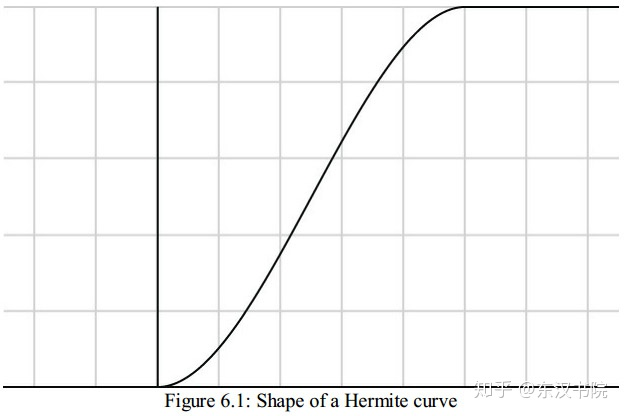

# OpenGL-Build-In Math Function （内置数学函数）
## 2023-09-06
- （今天是结婚6周年纪念日）每天学习一点点，一点点进步

GLSL support many build-in functions to perform mathematical operations and manipulate data in variables. The common math functions includes **abs** **sign** **ceil** **floor** **trunc** **round** **fract** **mod** **modf** **min** **max** **clamp**. For the most part, these function operation on verctors as well as scalars, but otherwise behave like thier counter parts in the C standars libaries. 

## clamp()

```glsl
vec4 clamp(vec4 x, float minVal, float maxVal)
vec4 clamp(vec4 x, vec4 minVal, vec4 maxVal)
```
 这个函数会把输入的x参数截断到 minVal 和 maxVal 的范围内。比如minVal 是 0.0,maxVal是 1.0 则 x 会被约束到0.0 到 1.0之间。

## 插值函数:
  ## step(edge, x) 步进函数
  ```glsl
    vec4 step(vec4 edge, vec4 x)    
  ```
  step函数会基于输入的两个参数返回一个值，要么是0.0，要么是1.0(非黑即白)
  if x < edge return 0.0
  if x > edge return 1.0

  > *step 函数相当于比较大小*
  ## smoothstep(x, y, a)
  平滑过渡，x 起点 y终点，a是影响因素

  y必须大于x , if a < x 返回 0, if a > y 返回 1。 在x y之间 返回  3a^2-2a^3

  smoothstep的算法如下：
  ```glsl
    vec4 smoothstep(vec4 edge0, vec4 edge1, vec4 x) {
      vec4 t = clamp((x - edge0) / (edge1 - edge0), 0.0, 1.0);
      return t * t * (vec4(3.0) - 2.0 * t);
    }
  ```
  > smoothstep 产生图像叫 **哈米特曲线**,它的操作叫**米哈特插值**;它返回的值永远是0 ~ 1; 通常这个曲线长成这个样：
  
  ## mix() 颜色混合

 ```glsl
 vec4 mix(vec4 x, vec4 y, float a) {
  return x + a * (y - x)
 }
 ```

 